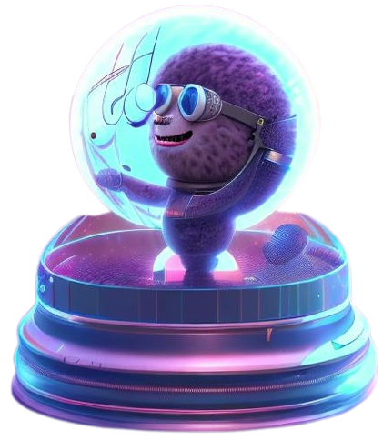

  <h1>
    MU-LLaMA:  Music Understanding Large Language Model
    
  </h1>

This is the official repository for *MU-LLaMA: Large Language Model for Music Question Answering*

## Introduction
The MU-LLaMA model is Music Understanding Language Model designed with the purpose of answering questions based on music. Our model is also designed with the purpose of captioning music files to generate Text-to-Music Generation datasets. We also provide the code for generating our MusicQA dataset from MusicCaps and the FMA dataset.

## MusicQA Dataset Generation

We use the MusicCaps and the FMA dataset to generate our MusicQA dataset. You can download the generated MusicQA dataset here. To generate the dataset yourself, you can use the scripts in the MusicQA folder. By running 'musiccaps_process.py' and 'MTT_process.py', you can generate the question answer pairs. 
